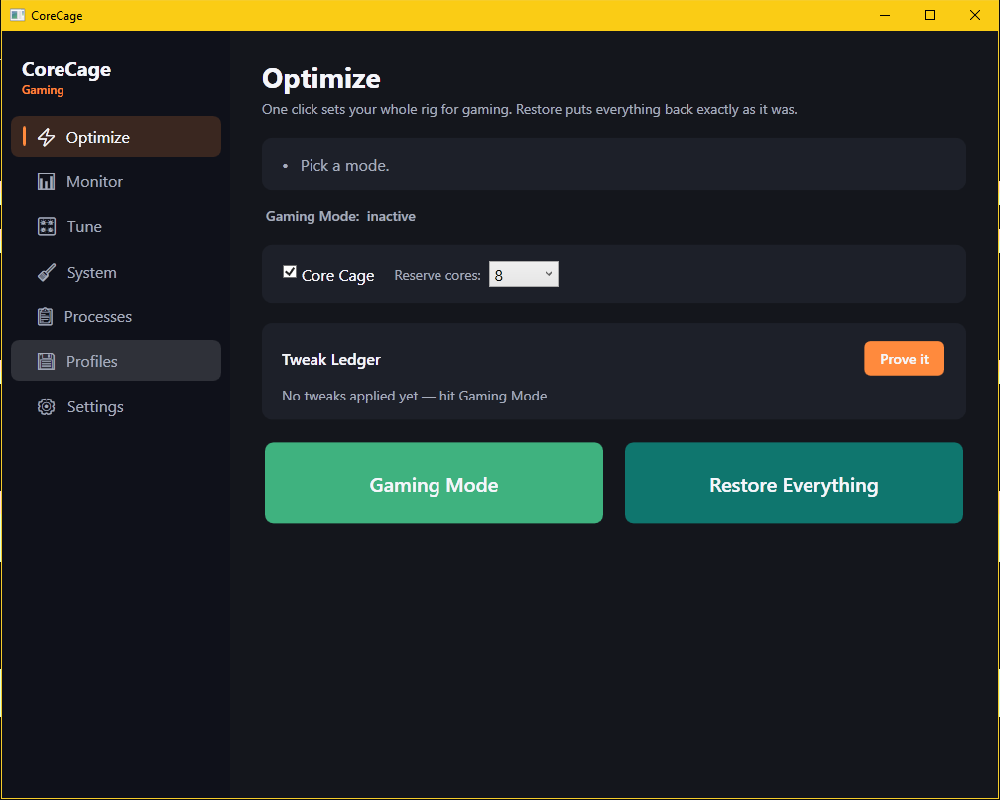

# CoreCage

**Cage the background. Free the frames.**

CoreCage is an open-source Windows FPS-boost app for competitive PC gaming. Its one rule: **no
placebo tweaks.** Every optimization is either provably safe-and-reversible, or measured on *your*
rig with [PresentMon](https://github.com/GameTechDev/PresentMon) before you're asked to trust it.
It's .NET 8 / WPF, fully EAC-safe (user-mode only — no kernel drivers), and every change is one
button away from being undone.



## Why

Most "game booster" apps ship a pile of registry tweaks and ask you to take the FPS gain on
faith. Half of them do nothing; some make things worse. CoreCage refuses that. The flagship
feature — **Core Cage** — reserves your top CPU cores for the game and confines every background
process onto the rest, and the built-in **Prove It** benchmark runs a real before/after PresentMon
A/B so you see the actual delta on your hardware.

### The honest number

On one rig — **Ryzen 5 5600G / RTX 3060** — Core Cage took *Arc Raiders* from **77 → ~150 fps**,
with **1% lows from 48 → 85**. That is a measurement on *one* machine, not a guarantee. The whole
point of CoreCage is that you don't take that number on faith: click **Prove It** and measure it
on yours.

## Features

CoreCage is built around seven feature pillars (several of them live together on the one-click **Optimize** page):

| Pillar | What it does |
|---|---|
| **Core Cage** ⚡ | The flagship. Reserves the top *N* logical cores for the foreground game and cages every background process onto the remaining cores via user-mode affinity. Whitelists the game, foreground app, audio engine, and protected system processes. |
| **Gaming Mode++** ⚡ | One-click pipeline: MSI interrupt mode, NIC hardening, GameDVR/Game Bar + background-UWP policy, QoS DSCP marking, EAC-safe IFEO priority, and core-unpark + perf floor. |
| **Prove It (A/B benchmark) + Tweak Ledger** ⚡ | PresentMon-backed before/after benchmark of whatever's currently active, plus a ledger of every applied tweak and what it earned you. No claimed gain is un-measured. |
| **Monitor** 📊 | Live CPU/GPU temp, RAM, and hardware read straight from the in-process engine. A dead sensor shows a dash — never a fake reading. |
| **Tune** 🎛 | Advanced, opt-in hardware tuning (GPU core-offset auto-tune, power limit) — off by default, stability-gated. See [safety](docs/safety.md). |
| **Community Profiles** 💾 | Per-game tuning profiles. Drop a JSON file in [`profiles/`](profiles/) and PR it. |
| **Big Red Button** 🧹 | **Restore Everything** — reverses every change CoreCage ever made, in dependency-correct order, and never throws. |

## Requirements

- **Windows 10 or 11** (x64)
- **[.NET 8 SDK](https://dotnet.microsoft.com/download/dotnet/8.0)** to build from source
- Some features (registry, power plan, IFEO, services) require **running as Administrator**
- GPU auto-tune / power limit require an **NVIDIA GPU** (`nvidia-smi`); they're off by default

## Build from source

```powershell
git clone https://github.com/psgods101/CoreCage.git
cd CoreCage
dotnet build -c Release
dotnet test -c Release
```

That builds `CoreCage.sln` (Core library, WPF app, and test project) and runs the full test suite.
CI runs the same two commands on `windows-latest` for every push and PR — see
[`.github/workflows/ci.yml`](.github/workflows/ci.yml).

The WPF app (`src/CoreCage.App`) launches on Windows only.

## Safety

CoreCage is designed to run on the same machine you play anti-cheat games on:

- **No kernel drivers.** Everything is user-mode.
- **Never touches game memory.** No injection, no hooks, no reads/writes into a running game.
  It tunes the environment around the game — priority, affinity, power, network — not the game.
- **Every change is reversible.** The **Big Red Button** restores power plan, timer resolution,
  DNS/TCP, QoS, NIC properties, priorities, affinities, and registry from snapshots, and never
  throws. Modes fall back to it if their own revert fails, so a partial revert can't strand your rig.
- **Honest tiers.** Safe tweaks (priority, affinity, timer, GameDVR, UWP) are on by default;
  hardware-write tweaks (GPU offset, GPU power limit, CPU SMU/ryzenadj) are Caution — off by
  default and searched conservatively.

Full posture and the per-tweak Safe/Caution table: **[docs/safety.md](docs/safety.md)**.

## Contributing

- **Community game profiles** — the easiest way to help. Add a `.json` file to
  [`profiles/`](profiles/) describing how CoreCage should tune a game, and open a PR. The format,
  fields, and what actually drives runtime behavior are documented in
  [`profiles/SCHEMA.md`](profiles/SCHEMA.md). Include your measured before/after numbers as
  review evidence.
- **New modes** — CoreCage has a clean seam for adding a whole optimization mode (Coding,
  Streaming, or a private module) without forking `CoreCage.Core`: implement `IModeModule` and call
  `ModeRegistry.Register`. See **[docs/modes.md](docs/modes.md)**.

Please keep the project's core promise intact: no un-measured performance claims, and everything
stays user-mode and EAC-safe.

## License

MIT — see [LICENSE](LICENSE).
